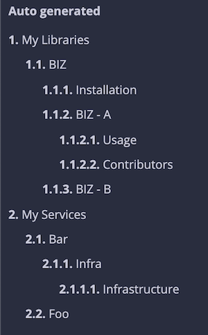

<h1 align="center">
  
  <br>
  All The Markdowns!
  <br>
</h1>

<div align="center">
  <a href="https://github.com/bombsimon/mdbook-all-the-markdowns/actions/workflows/rust.yml">
    
  </a>
  <a href="https://crates.io/crates/mdbook-all-the-markdowns">
    
  </a>
</div>

This is a [`mdbook` preprocessor][preprocessor] that will walk a specified base path and add all
the markdowns to your `mdbook`. This is pretty naive and will probably work best
for smaller projects but feel free to give it a go for any folder structure!

## Configuration

The preprocessor can be configured with the following settings:

```toml
[preprocessor.all-the-markdowns]
# The title to use in the index on the left.
# Can be useful if book also consist of static content.
section_title = "Auto generated"

# The base directory to scrape, this is usually the root of your project.
base = "./examples/example-folder"

# Paths to ignore. No matter where you set your base you can always ignore given
# patterns. These needs to be relative to the base since the directory traverser
# will match if a file or director _starts with_ any of these patterns.
ignore = []
```

## Example

Given the following folder structure:

```sh
.
├── my-libraries
│   └── lib-biz
│       ├── INSTALLATION.md
│       ├── README.md
│       ├── sub-lib-a
│       │   └── README.md
│       └── sub-lib-b
│           └── README.md
└── my-services
    ├── service-bar
    │   └── README.md
    └── service-foo
        └── README.md
```

Based on the title in each document, combined with the folder names as title
case, the preprocessor would render the following:



## Test

You can test rendering any of the example folders in this directory with the
book found in [`examples/book1`][book1] with `mdbook serve examples/book1`.

  [book1]: ./examples/book1/
  [preprocessor]: https://rust-lang.github.io/mdBook/for_developers/preprocessors.htmlu
